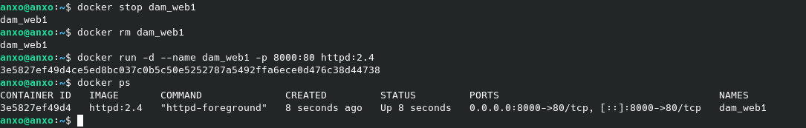

# Tarea 3
## Angel Piñero Andion

### La siguiente práctica es una lista de tareas que tenéis que hacer.

### Por cada tarea tenéis que ir poniendo los comandos utilizados y, brevemente, describir el proceso y como compruebas que se ha realizado lo pedido en un fichero (nombre "Readme.md") con formato markdown.

### Crear un repositorio en github para subir este fichero

### Cada dos apartados tenéis que hacer un commit nombrando el numero del apartado

### En la respuesta pon el enlace a tu repositorio en github

### Utiliza la imagen de Apache, tag 2.4 y apoyandote en la mini guía de docker sigue las instrucciones:

1. ### Descarga la imagen 'httpd' y comprueba que está en tu equipo.
    Descargamos la imagen de apache2 con el siguiente comando:
    ```docker pull httpd:2.4```
    Comprobamos que la imagen se ha descargado correctamente con el siguiente comando:
    ```docker images```


2. ### Crea un contenedor con el nombre 'dam_web1'.

    Creamos el contenedor con el siguiente comando:
    ```docker run -d --name dam_web1 httpd:2.4```
    Comprobamos que el contenedor se ha creado correctamente con el siguiente comando:
    ```docker ps```

3. ### Si quieres poder acceder desde el navegador de tu equipo, ¿que debes hacer?
    Primero debemos parar y eliminar el contenedor, para poder crear otro con el puerto mapeado con el siguiente comando:
    
    ```docker stop dam_web1``` y ```docker rm dam_web1```

    Para poder acceder desde el navegador de mi equipo, debo mapear el puerto del contenedor al puerto de mi equipo con el siguiente comando:

    ```docker run -d --name dam_web1 -p 8000:80 httpd:2.4```

    Comprobamos que el contenedor se ha creado correctamente con el siguiente comando:

    ```docker ps```



Accedemos desde el navegador a la dirección http://localhost:8000 y comprobamos que se muestra la página de apache2.


4. ### Utiliza bind mount para que el directorio del apache2 'htdocs' esté montado un directorio que tu elijas.

    Creamos un directorio en nuestro equipo con el siguiente comando:

    ```mkdir /home/anxo/damWeb```

    Creamos un contenedor con el directorio mapeado con el siguiente comando:

    ```docker run -d --name dam_web1 -p 8000:80 -v /home/anxo/damWeb:/usr/local/apache2/htdocs httpd:2.4```

    Comprobamos que el contenedor se ha creado correctamente con el siguiente comando:

    ```docker ps```


5. ### Realiza un 'hola mundo' en html y comprueba que accedes desde el navegador.
    Creamos un archivo index.html en el directorio /home/anxo/damWeb con el siguiente contenido:

        <html>
            <head>
                <title>Hola Mundo</title>
            </head>
            <body>
                <h1>Hola Mundo</h1>
            </body>
        </html>


Accedemos desde el navegador a la dirección http://localhost:8000 y comprobamos que se muestra la página de Hola Mundo.


6. ### Crea otro contenedor 'dam_web2' con el mismo bind mount y a otro puerto, por ejemplo 9080.

    Creamos un contenedor con el directorio mapeado y en otro puerto con el siguiente comando:

    ```docker run -d --name dam_web2 -p 9080:80 -v /home/anxo/damWeb:/usr/local/apache2/htdocs httpd:2.4```

    Comprobamos que el contenedor se ha creado correctamente con el siguiente comando:

    ```docker ps```


7. ### Comprueba que los dos servidores 'sirven' la misma página, es decir, cuando consultamos en el navegador:
    ### http://localhost:9080
    ### http://localhost:8000


8. ### Realiza modificaciones de la página y comprueba que los dos servidores 'sirven' la misma página

    Modificamos el archivo index.html en el directorio /home/anxo/damWeb con el siguiente contenido:

        <html>
            <head>
                <title>Hola Mundo</title>
            </head>
            <body>
                <h1>Hola Mundo desde dam_web2</h1>
            </body>
        </html>
    
    Comprobamos los cambios:
    
